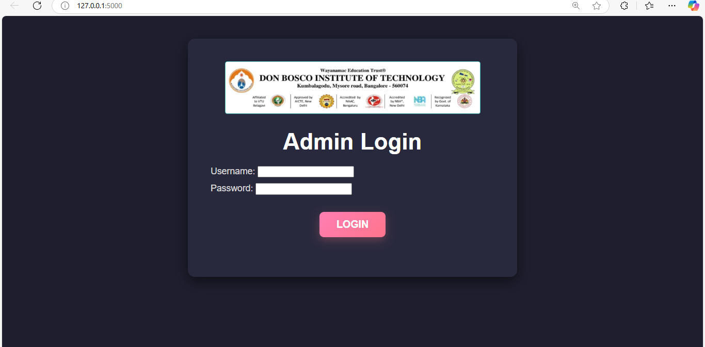

This project is a DDoS Detection & Alert System built using Flask, Google Gmail API, and Python. It detects suspicious traffic patterns and sends an email alert when a potential DDoS attack is detected.

**Features**

Logs incoming traffic requests (IP & timestamp).

Detects potential DDoS attacks (multiple requests from the same IP in a short time).

Sends email alerts when an attack is detected.

Web-based login authentication system.

Flask-based dashboard to monitor traffic.
**Installation & Setup**

1️⃣ Prerequisites

Make sure you have the following installed:

Python 3.11.8

Flask (pip install flask)

Google API Client (pip install google-auth google-auth-oauthlib google-auth-httplib2 google-api-python-client)

dotenv (pip install python-dotenv)

2. Configure Gmail API Authentication

Go to Google Cloud Console.

Create a new project and enable the Gmail API.

Generate OAuth 2.0 Credentials:

Select OAuth Client ID.

Set http://localhost:8080/ as the redirect URI.

Download the client_secret.json file and place it in the project directory.

3. Set Up Environment Variables

Create a .env file in the project root:

SECRET_KEY=your_secret_key
ALERT_EMAIL=alert_recipient@gmail.com

4. Run the Flask Application

python app.py

By default, the app will run on http://127.0.0.1:8000/
